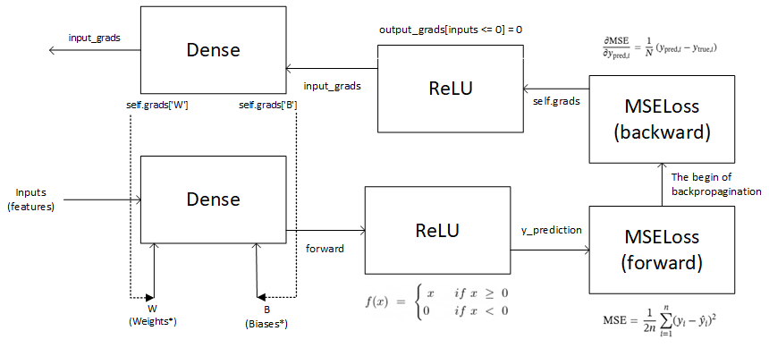

# SlayTheMatrix

**SlayTheMatrix** — это кастомный ИИ-агент, написанный на Python и NumPy без использования тяжелых фреймворков глубокого обучения (PyTorch/TensorFlow). Проект реализует модульную архитектуру нейросети с нуля и подключается к визуальной новелле *Slay the Princess* через сетевой TCP-протокол для автоматического прохождения игры.


## Особенности

* **Собственный NN-движок с нуля:** Полносвязные слои, функции активации и оптимизаторы реализованы исключительно на матричных операциях NumPy.
* **Ручной Backpropagation:** Градиентный спуск (SGD) и распространение ошибки без использования автограда.
* **Событийный TCP-интерфейс:** Внедрение легковесного сокет-клиента в runtime игрового движка Ren'Py.
* **Zero-OCR парсинг:** Перехват чистых текстовых реплик и структуры динамических меню выбора в реальном времени напрямую из памяти игры.

---

## Архитектура ИИ-Движка

Нейросеть построена по модульному принципу, аналогичному современным DL-фреймворкам. Базовый абстрактный класс `Layer` инкапсулирует параметры, градиенты и методы шага вперед/назад.

### Вычислительный граф (Forward & Backward Pass)

Ниже представлена схема прохода сигнала и вычисления градиентов, реализованная в проекте:



### Пример базового полносвязного слоя (Dense)

```python
class Dense(Layer): # Наследуется от Layer
    def __init__(self, input_dim: int, output_dim: int):
        super().__init__()
        he_scale = np.sqrt(2 / input_dim) # Инициализация весов методом Каиминга Хе
        self.params['W'] = np.random.randn(input_dim, output_dim) * he_scale # Матрица весов
        self.params['B'] = np.zeros((1, output_dim)) # Смещение весов (вектор)
        
        # Градиенты аналогичных размеров
        self.grads['W'] = np.zeros_like(self.params['W'])
        self.grads['B'] = np.zeros_like(self.params['B'])

    def forward(self, inputs: np.ndarray) -> np.ndarray:
        self.inputs = inputs
        return self.inputs @ self.params['W'] + self.params['B']

    def backward(self, output_grads: np.ndarray) -> np.ndarray:
        self.grads['W'] = self.inputs.T @ output_grads
        self.grads['B'] = np.sum(output_grads, axis=0, keepdims=True)
        return output_grads @ self.params['W'].T
```


## Схема интеграции

Вместо сложного парсинга исходных скриптов игры, агент перехватывает игровой контекст через хуки в `screens.rpy`:

1. **Диалоги (`screen say`):** Коллбэк `config.character_callback` ловит каждую отрендеренную строчку текста и шлет её на сервер асинхронно в JSON: `{"type": "dialogue", "data": {"speaker": "...", "text": "..."}}`.
2. **Выборы (`screen choice`):** При появлении развилки игра замирает, отправляет массив доступных опций (`{"type": "choice_request", ...}`) и ждет ответа от ИИ. Сервер возвращает `{"chosen_index": X}`, и игра автоматически прожимает нужный вариант с помощью таймера.


## RoadMap или то, что на данный момент сделано

- [x] Декомпиляция и анализ структуры сцен Ren'Py.
- [x] Реализация модульного каркаса NN.
- [x] Архитектура асинхронного TCP-взаимодействия игра-сервер.

## 📄 Лицензия

Проект распространяется под лицензией MIT. Подробнее см. в файле [LICENSE](LICENSE).
